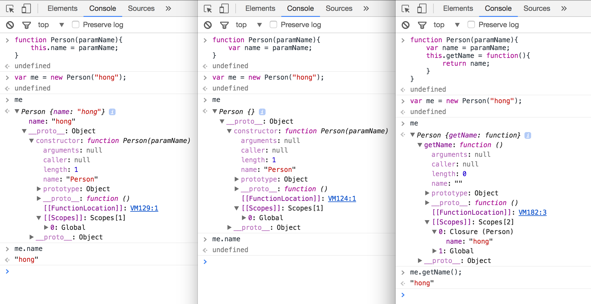

# CLOSURE

### local 변수에 대한 참조를 가지는 함수

 Person 함수 내부에서 선언된 변수는 Person이라는 오브젝트를 생성했을 때 함수의 실행 후 global scope에서 접근이 불가능하다.
 Person 오브젝트 생성 후, Person 함수 내부 변수 name를 참조하기 위한 getName 함수를 추가하였고, closure scope에서 Person의 name에 접근할 수 있게 되었다.
 
